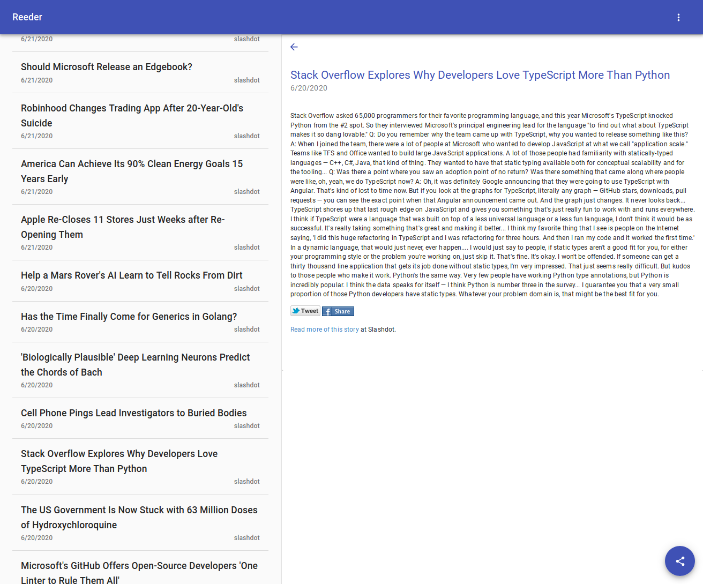

# Reeder

## XMPP-based feeds reader

### Try it out

Live demo: https://reeder.netlify.app/  
Requirements before trying out the live demo:

- https://modules.prosody.im/mod_pubsub_feeds.html
- `cross_domain_bosh = true` https://prosody.im/doc/setting_up_bosh#cross-domain_issues

You can also reach [@SeveFP](https://github.com/SeveFP) for some working credentials :)

To run locally: `npm start`

### What is Reeder?

Reeder is an rss/atom feeds reader with the particularity that is purely based on XMPP's PubSub.
This means, the content Reeder fetches, does not come from the original feed sources but rather
from an XMPP PubSub service.

Currently, it uses Prosody's `mod_pubsub_feeds` but in future updates, Reeder will also allow
the user to add their own personal feeds.
Support for sharing articles with XMPP contacts/groups, desktop notifications is included.
Also, there's a small PWA support.

### Rationale

I'm a huge supporter of XMPP and Reeder is a very convenient way to handle and store
my favourite news sources. No more backups from desktop to desktop, or mobile to mobile.
The XMPP server can handle this perfectly and also give in return many other features like
content sharing with other contacts.

### Comments

It is not recommended to use Reeder as a replacement of many other feed readers,
but its current state is good enough for personal use.
There are many features yet to be implemented, please do not consider Reeder
as an stable product until further updates.
